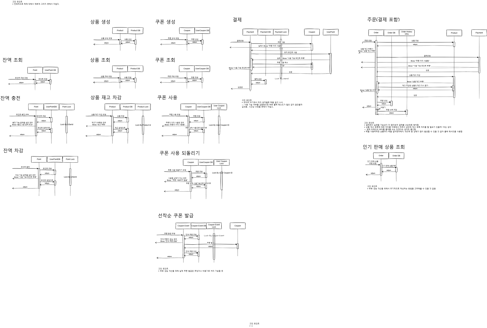
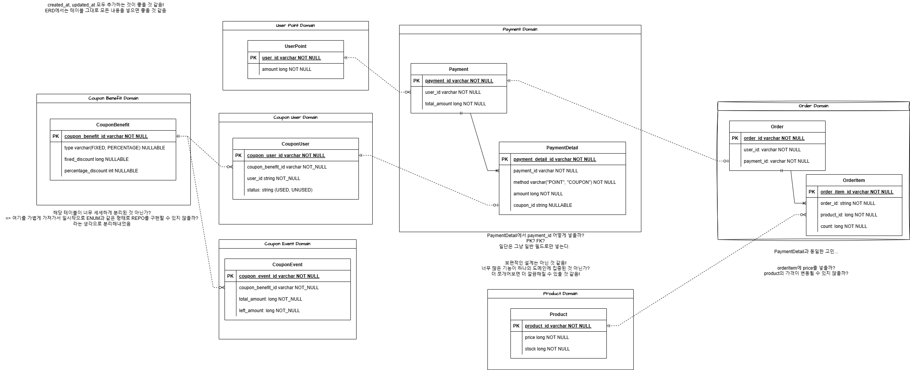

# 시퀀스 다이어그램

### 고려사항

* 반복되는 내용을 줄이고자 도메인별로 분리했습니다.

* 복잡한 Payment부분을 Order에서 분리해냈습니다.

* 락을 표현하고자 했지만, 아쉬움이 많이 남습니다.

### 아쉬운점

* DB나 Infra를 따로 분리하지 않고 자기 참조 형식으로 작성했으면 더 좋았을 것 같습니다.

* 락을 어떻게 표현하면 좋을지 더 고민이 필요합니다.

* alt나 opt로 예외를 처리했으면 좋을 것 같습니다.

### 피드백 받고 싶은 내용 

* 주문시에 동시성 이슈를 해결하기 위해 락을 거는 방법과 롤백을 하는 방법 두가지를 고려해봤는데요.
  * 락을 걸게 될 경우 차감하는 Product별 락을 걸어줘야 해서 락이 많아지고 데드락 등 이슈로 이어질 수 있을 것 같아 배제했습니다.
  * 따라서 롤백 메소드를 구현했습니다.
  * 그 외에도 다른 방법을 고려해볼 수 있을까요?
  * 롤백 메소드를 만들어 처리하는 것이 실무에서도 사용 가능할까요?

# ERD

### 고려사항
* 다양한 쿠폰을 지원하기 위해 Benefit을 분리했습니다.

* 도메인별로 Entity를 분리하여 도메인간에서는 약한 의존성을 가지도록 했습니다.

### 아쉬운 점
* created_at과 updated_at이 모두 다 빠져있습니다 ㅠㅠ 시간상 넣지 못했어요..

* 사실 Benefit과 같은 부분은 너무 간단해서 굳이 테이블로 뺐어야 했나..라는 고민이 있습니다.

### 피드백 받고 싶은 내용

* PaymentDetail 테이블을 분리해서 각 결제 방법별로 결제가 되는 것을 고려했는데 정규화를 너무 심하게 한 것일까요?

* Order과 OrderItem에서 OrderId를 어떻게 저장하면 좋을지에 대해 고민이 있었습니다.
  * OrderItem에서 OrderId과 productId를 결합하여 PK로 저장하는 방안을 생각해봤는데, 실무에서도 그런 방식을 채택한 경우가 있나요?

  * OrderItem에서 OrderId를 FK로 지정하는 것은 제약조건들 때문에 별로일 것이라고 생각했는데, 실무자의 관점에서는 어떻게 생각하는지 궁금합니다.

  * 결국 OrderItem에서 OrderId를 단순 필드로 지정하고 필요하다면 추후 인덱스만 추가할 예정인데, 실무에서도 이러한 방식으로 개발을 하는지 궁금합니다.

 
