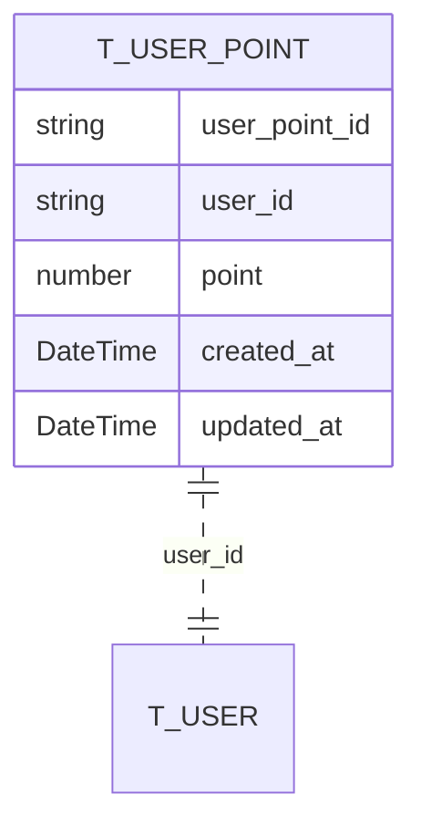
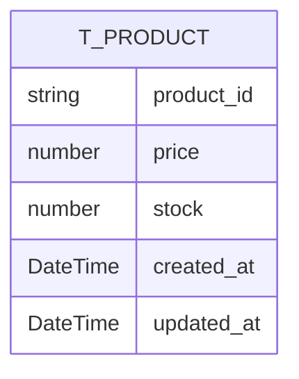
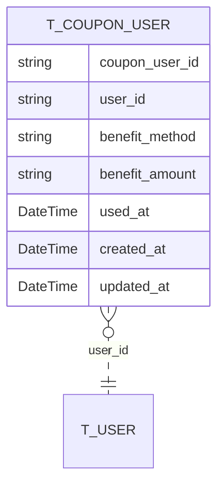
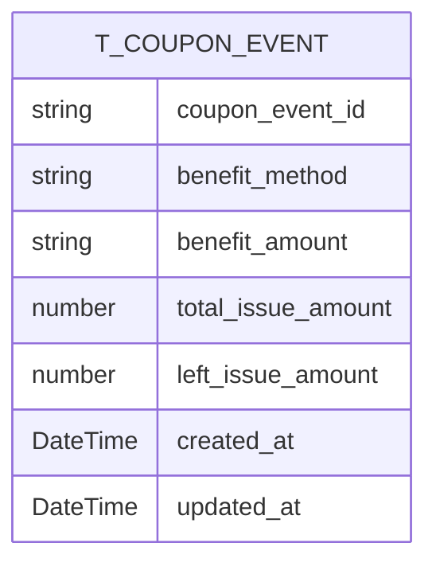
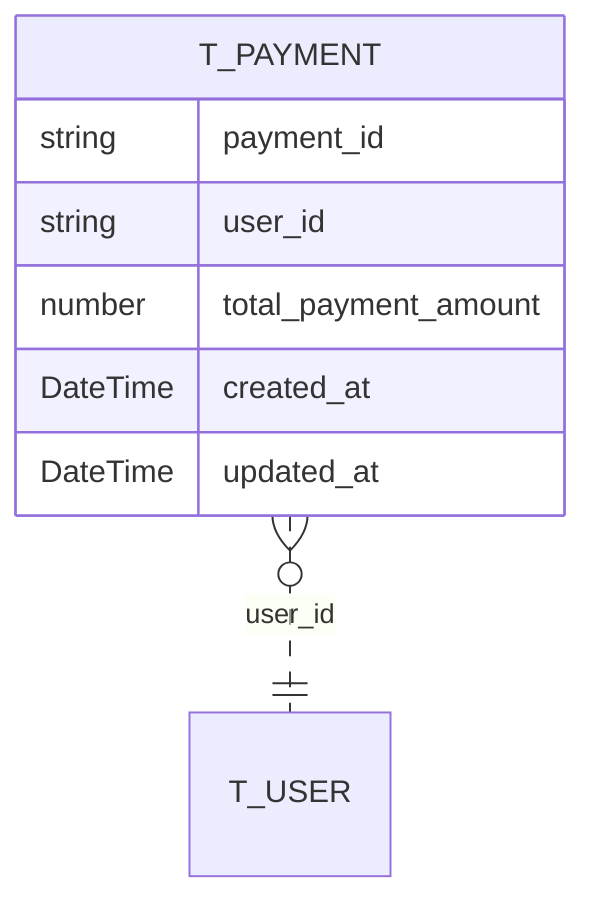
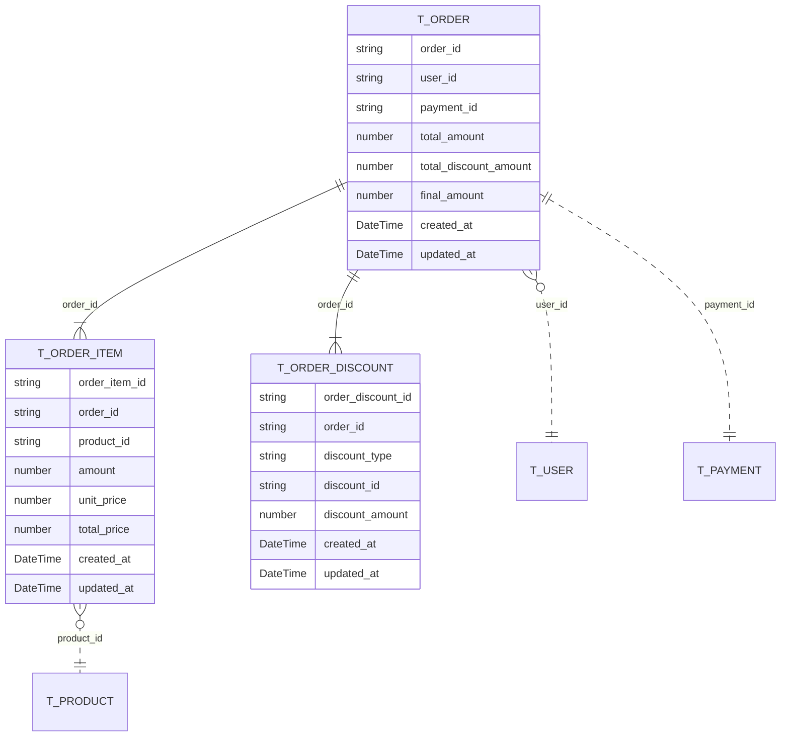

# 📊 데이터베이스 설계

## 📝 개요

이 문서는 Voyage Shop 서비스의 데이터베이스 모델을 정의합니다. 각 도메인별 엔티티와 관계를 설명합니다.

## ⚙️ 공통 고려사항

- 📌 **타입 관리**: enum 값들은 추후 확장성(마이그레이션의 편의)을 위해 string으로 선언하였습니다.
- 📌 **감사 추적**: 모든 테이블은 생성일시(`created_at`)와 수정일시(`updated_at`)를 포함하여 변경 이력을 추적합니다.
- 📌 **이름 규칙**: 모든 테이블은 `T_` 접두사를 사용하며, 모든 ID는 문자열(string) 타입을 사용합니다.

## 📄 문서 작성 방식

- 🔍 각 다이어그램에는 해당 도메인에 속하는 테이블의 속성을 자세하게 작성했습니다.
- 🔍 다른 도메인에 속하는 참조 테이블(예: `T_USER`)은 테이블명만 표시하고 속성은 생략했습니다.
- 🔍 관계 표현은 실제 DB 관계에 맞게 ERD 표기법을 사용했습니다.

## 💰 사용자 포인트 도메인 테이블

### T_USER_POINT

| 필드명 | 타입 | 설명 |
|-------|------|------|
| `user_point_id` | string | 포인트 레코드의 고유 식별자 |
| `user_id` | string | 포인트를 소유한 사용자 참조 |
| `point` | number | 현재 포인트 잔액 |
| `created_at` | DateTime | 생성 일시 |
| `updated_at` | DateTime | 수정 일시 |

### 설계 이유
- **별도 테이블로 분리**: 사용자 정보와 포인트 정보를 분리하여 포인트 관련 트랜잭션이 사용자 테이블에 영향을 주지 않도록 설계했습니다.
- **단순한 구조**: 포인트는 단순히 증감만 있기 때문에 복잡한 관계나 필드 없이 단순하게 구성했습니다.

## 🛒 상품 도메인 테이블

### T_PRODUCT

| 필드명 | 타입 | 설명 |
|-------|------|------|
| `product_id` | string | 상품의 고유 식별자 |
| `price` | number | 상품의 판매 가격 |
| `stock` | number | 현재 재고 수량 |
| `created_at` | DateTime | 생성 일시 |
| `updated_at` | DateTime | 수정 일시 |

### 설계 이유
- **최소한의 필드**: 기본적인 상품 정보만 포함하여 확장성을 고려했습니다. 추후 카테고리, 상세 정보 등은 별도 테이블로 확장할 수 있습니다.
- **재고 관리**: stock 필드를 통해 실시간 재고 관리가 가능하도록 했습니다.

## 🎫 쿠폰 사용자 도메인 테이블

### T_COUPON_USER

| 필드명 | 타입 | 설명 |
|-------|------|------|
| `coupon_user_id` | string | 쿠폰 사용자의 고유 식별자 |
| `user_id` | string | 쿠폰을 소유한 사용자 참조 |
| `benefit_method` | string | 할인 방식(정액/정률) |
| `benefit_amount` | string | 할인 정도 |
| `used_at` | DateTime | 쿠폰 사용 시점(NULL 시 미사용) |
| `created_at` | DateTime | 생성 일시 |
| `updated_at` | DateTime | 수정 일시 |

### 특수 필드 설명
- **`benefit_method`** 는 아래 값만을 가집니다:
  - 💲 `DISCOUNT_FIXED_AMOUNT`: 정액 할인
  - 📊 `DISCOUNT_PERCENTAGE`: 정률 할인

- **`used_at`** 은 NULLABLE입니다:
  - 쿠폰이 사용된 경우에만 사용 시점을 저장합니다.
  - NULL이면 미사용, 값이 있으면 사용된 쿠폰입니다.

- **`benefit_amount`** 는 `benefit_method`에 따른 할인 양을 저장합니다:
  - 예시: method = "DISCOUNT_FIXED_AMOUNT", amount = "100" 일 경우 100포인트 할인

### 설계 이유
- **쿠폰 복사 방식**: 쿠폰 발급 시 쿠폰 이벤트의 정보를 복사하여 저장합니다. 이는 쿠폰 이벤트가 변경되더라도 이미 발급된 쿠폰의 혜택은 변경되지 않도록 하기 위함입니다.
- **유연한 할인 방식**: `benefit_method`와 `benefit_amount`를 분리하여 다양한 할인 정책(정액/정률)을 지원합니다.
- **문자열 타입 활용**: `benefit_method`를 enum 대신 string으로 저장하여 새로운 할인 방식이 추가되어도 스키마 변경 없이 대응 가능합니다.

## 🎟️ 쿠폰 이벤트 도메인 테이블

### T_COUPON_EVENT

| 필드명 | 타입 | 설명 |
|-------|------|------|
| `coupon_event_id` | string | 쿠폰 이벤트의 고유 식별자 |
| `benefit_method` | string | 할인 방식 |
| `benefit_amount` | string | 할인 정도 |
| `total_issue_amount` | number | 총 발급 가능 수량 |
| `left_issue_amount` | number | 남은 발급 가능 수량 |
| `created_at` | DateTime | 생성 일시 |
| `updated_at` | DateTime | 수정 일시 |

### 설계 이유
- **쿠폰 발급 관리**: `total_issue_amount`와 `left_issue_amount`를 통해 쿠폰 발급 수량을 제한하고 관리할 수 있도록 설계했습니다.
- **쿠폰 템플릿 역할**: 이 테이블은 쿠폰의 템플릿 역할을 하며, 실제 사용자에게 발급될 때 T_COUPON_USER에 복사됩니다.
- **동시성 제어**: `left_issue_amount` 필드를 통해 동시 요청 시에도 발급 수량을 초과하지 않도록 제어할 수 있습니다.

## 💳 결제 도메인 테이블

### T_PAYMENT

| 필드명 | 타입 | 설명 |
|-------|------|------|
| `payment_id` | string | 결제의 고유 식별자 |
| `user_id` | string | 결제를 수행한 사용자 참조 |
| `total_payment_amount` | number | 총 결제 금액 |
| `created_at` | DateTime | 생성 일시 |
| `updated_at` | DateTime | 수정 일시 |

### 설계 이유
- **주문과 분리**: 결제는 주문과 분리하여 관리합니다. 이를 통해 한 번의 결제로 여러 주문을 처리하거나, 주문 취소와 결제 환불을 독립적으로 관리할 수 있습니다.
- **최소 정보만 포함**: 결제 관련 민감 정보는 포함하지 않고, 필요한 경우 외부 결제 시스템과 연동할 수 있도록 최소한의 정보만 저장합니다.

## 📦 주문 도메인 테이블

### T_ORDER

| 필드명 | 타입 | 설명 |
|-------|------|------|
| `order_id` | string | 주문의 고유 식별자 |
| `user_id` | string | 주문한 사용자 참조 |
| `payment_id` | string | 결제 정보 참조 |
| `total_amount` | number | 주문 총액 |
| `total_discount_amount` | number | 총 할인 금액 |
| `final_amount` | number | 최종 결제 금액 |
| `created_at` | DateTime | 생성 일시 |
| `updated_at` | DateTime | 수정 일시 |

### T_ORDER_ITEM

| 필드명 | 타입 | 설명 |
|-------|------|------|
| `order_item_id` | string | 주문 상품의 고유 식별자 |
| `order_id` | string | 주문 참조 |
| `product_id` | string | 상품 참조 |
| `amount` | number | 주문 수량 |
| `unit_price` | number | 단위 가격 |
| `total_price` | number | 총 가격 |
| `created_at` | DateTime | 생성 일시 |
| `updated_at` | DateTime | 수정 일시 |

### T_ORDER_DISCOUNT

| 필드명 | 타입 | 설명 |
|-------|------|------|
| `order_discount_id` | string | 주문 할인의 고유 식별자 |
| `order_id` | string | 주문 참조 |
| `discount_type` | string | 할인 유형 |
| `discount_id` | string | 할인 ID |
| `discount_amount` | number | 할인 금액 |
| `created_at` | DateTime | 생성 일시 |
| `updated_at` | DateTime | 수정 일시 |

### 특수 필드 설명
- **`discount_type`** 은 아래 값만을 가집니다:
  - 🎫 `COUPON`: 쿠폰 할인

- **`discount_id`** 는 `discount_type`에 따라 다른 테이블의 ID를 참조합니다:
  - `COUPON`: T_COUPON_USER의 coupon_user_id를 참조

### 설계 이유
- **주문 분리 구조**: 주문(T_ORDER), 주문 상품(T_ORDER_ITEM), 주문 할인(T_ORDER_DISCOUNT)을 별도 테이블로 분리하여 유연성과 확장성을 높였습니다.
- **금액 정보 중복 저장**: 
  * 주문 시점의 가격을 unit_price에 저장하여 나중에 상품 가격이 변경되어도 주문 내역은 유지됩니다.
  * 계산된 금액(`total_amount`, `total_discount_amount`, `final_amount`)을 저장하여 조회 시 효율성을 높였습니다.
- **할인 타입 분리**: `discount_type`과 `discount_id`를 통해 다양한 할인 유형(쿠폰, 포인트 등)을 유연하게 지원할 수 있습니다.

## 📝 추가 정보

- 본 ERD는 개념적 설계이며, 실제 구현 시 DB에 따라 일부 데이터 타입이 달라질 수 있습니다.
- 관계 표현에 사용된 기호 설명:
  * 🔗 `||--|{` : 일대다 관계 (주문-주문상품)
  * 🔗 `}o..||` : 다대일 관계, 외래키가 nullable (선택적 참조)
  * 🔗 `||..||` : 일대일 관계 