# 🔄 시퀀스 다이어그램

## 고려사항
* 기능에 초점을 맞추어 작성
* 비교적 복잡한 주문/결제에 대해서만 작성
* 어플리케이션 서비스(앱서비스)와 도메인 서비스 단위로 작성
    * 어플리케이션 서비스에만 "어플리케이션" 접미사
* 일단, 성공 Case만 작성
    * 추후 실패 케이스 작성예정

## 주문/결제 기능 (성공시)

```mermaid
sequenceDiagram
    actor user as 사용자;
    participant order_app as 주문 어플리케이션;
    participant product as 상품;
    participant coupon_user as 유저별 쿠폰;
    participant point_user as 유저별 포인트;
    participant payment as 결제;
    participant order as 주문;

    user ->> order_app: 주문요청
    note over user,order_app: 상품별 주문량, 사용 쿠폰 ID

    order_app ->> product: 재고 차감 
    product ->> order_app: 
    
    order_app ->> product: 상품별 금액 조회  
    product ->> order_app: 

    order_app ->> order_app: user_id 락 걸기

    alt 주문시 쿠폰을 사용한 경우
        order_app ->> coupon_user: 쿠폰 사용
        coupon_user ->> order_app: 
    end

    order_app ->> coupon_user: 쿠폰 할인 금액 계산
    coupon_user ->> order_app: 

    order_app ->> point_user: 포인트 차감
    point_user ->> order_app: 
    
    order_app ->> order_app: user_id 락 풀기

    order_app ->> payment: 결제 정보 저장
    payment ->> order_app: 

    order_app ->> order: 주문 정보 저장
    order ->> order_app: 

    order_app ->> user: 주문 정보 반환 
``` 

