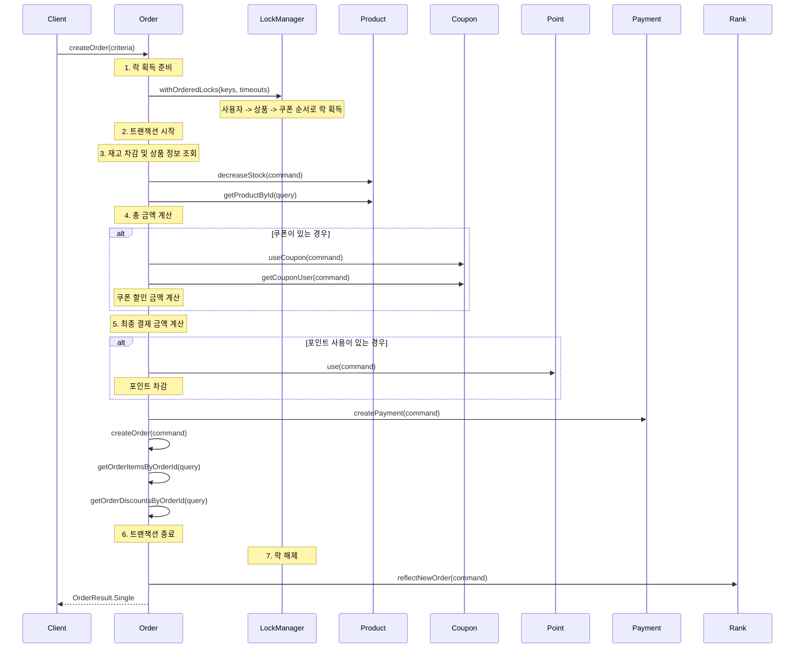
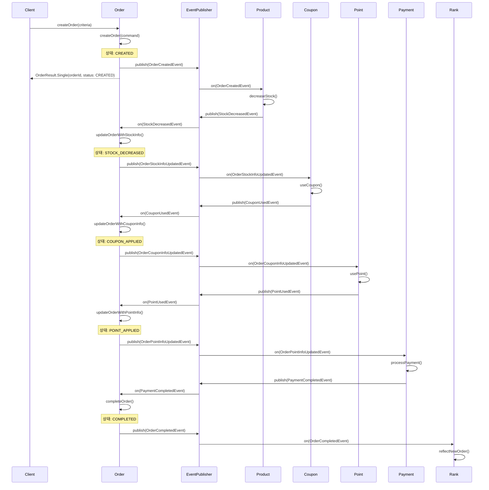
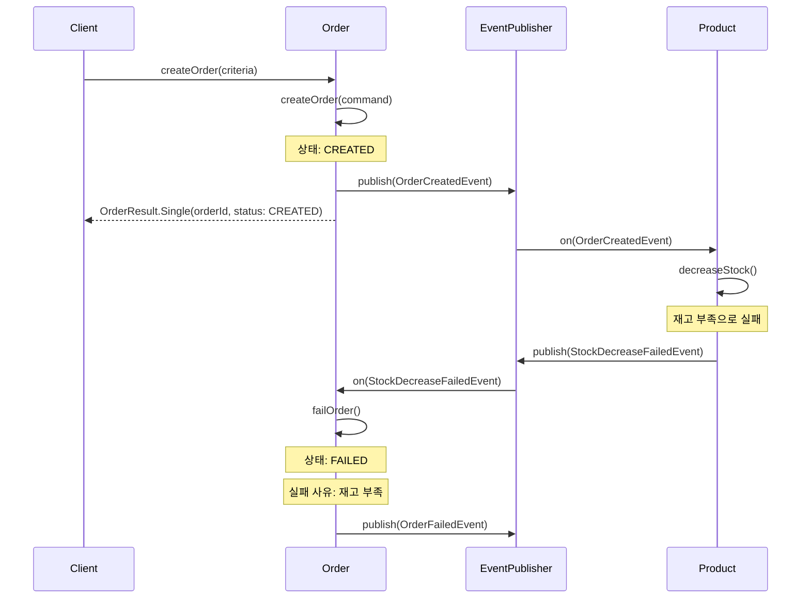
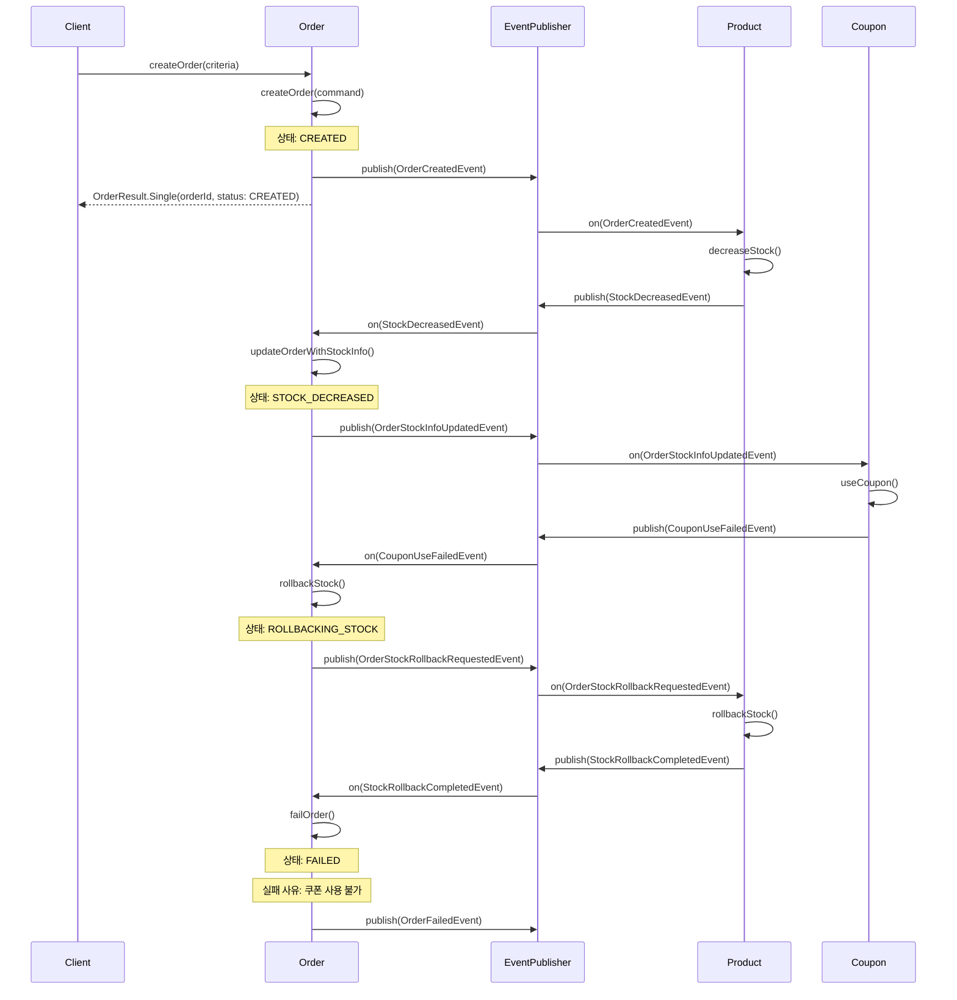
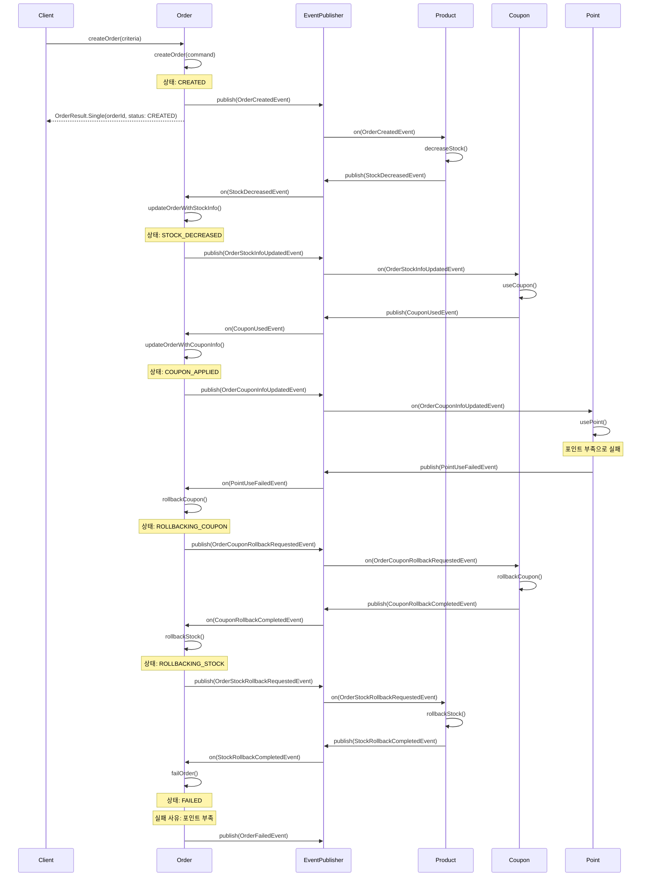
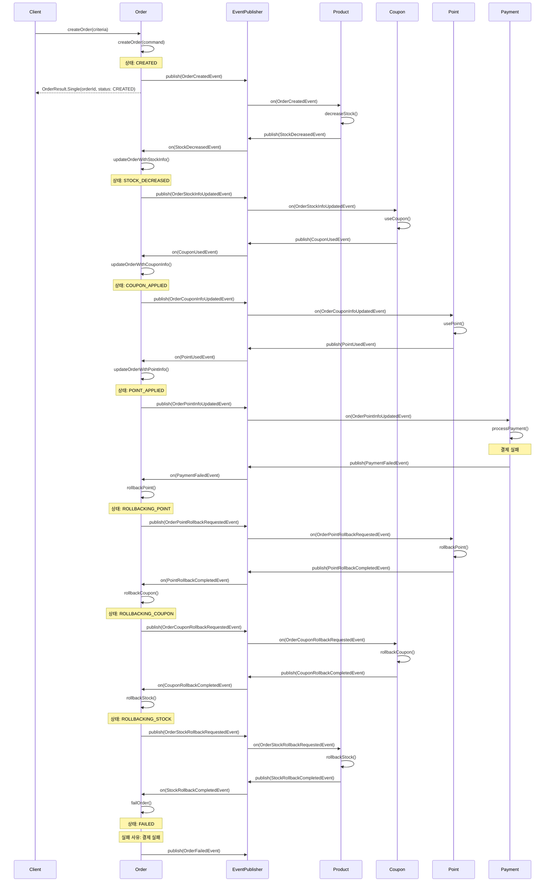
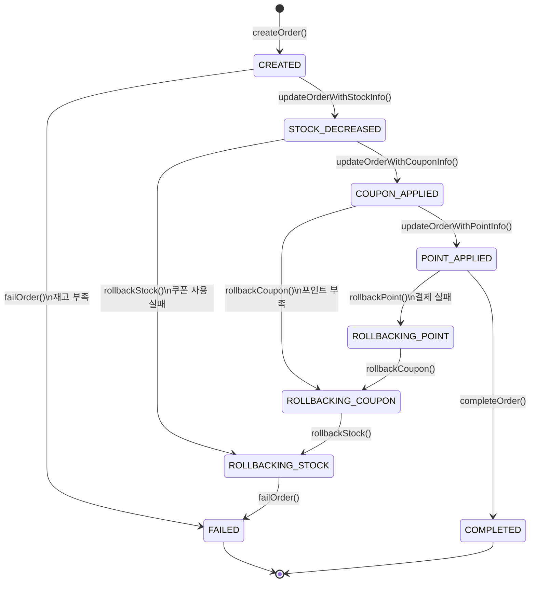
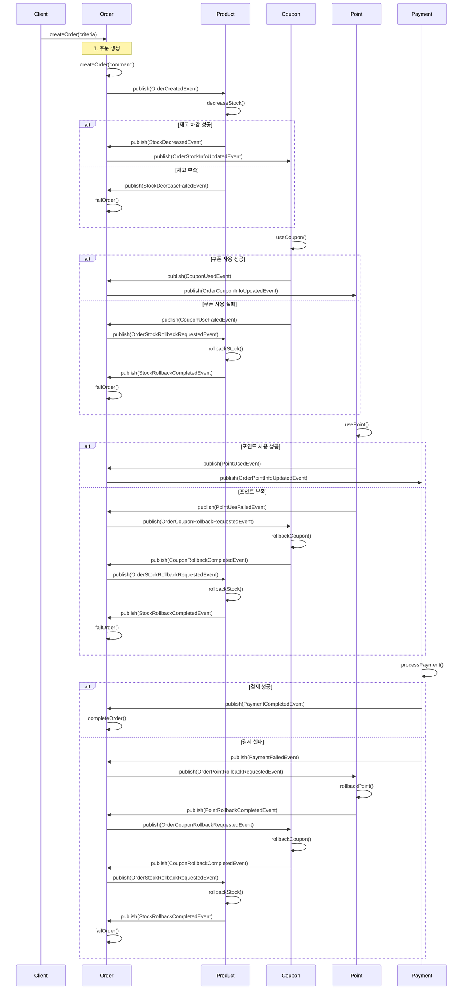

# STEP-16: Order를 이벤트 기반 Choreography 패턴으로의 전환

## 1. 현재 시퀀스 다이어그램



현재 구현은 다음과 같은 주요 단계로 구성되어 있습니다:

1. 클라이언트로부터 주문 생성 요청을 받습니다.
2. 분산 락을 획득합니다 (사용자 -> 상품 -> 쿠폰 순서).
3. 트랜잭션을 시작하고 재고를 차감합니다.
4. 총 금액을 계산합니다.
5. 쿠폰이 있는 경우 쿠폰을 사용하고 할인 금액을 계산합니다.
6. 최종 결제 금액을 계산합니다.
7. 포인트 사용이 있는 경우 포인트를 차감합니다.
8. 결제를 진행합니다.
9. 주문을 생성하고 관련 정보를 조회합니다.
10. 트랜잭션을 종료하고 락을 해제합니다.
11. 주문 아이템 랭킹을 반영합니다.
12. 결과를 클라이언트에 반환합니다.

이 구현은 분산 락을 사용하여 동시성 문제를 해결하고, 트랜잭션을 통해 데이터 일관성을 유지하는 것을 보여줍니다.

## 2. 이벤트 기반 Choreography 패턴으로의 전환

### 2.1 변경될 시퀀스 다이어그램



### 2.2 실패 상황 및 롤백 처리

#### 2.2.1 재고 차감 실패



#### 2.2.2 쿠폰 사용 실패



#### 2.2.3 포인트 차감 실패



#### 2.2.4 결제 실패




### 2.3 Order 상태 다이어그램



### 2.4 이벤트 정의

#### 2.4.1 주문 관련 이벤트

1. **OrderCreatedEvent**
   - 발행: 주문 생성 시
   - 데이터:
     - orderId: 주문 ID
     - userId: 사용자 ID
     - orderItems: 주문 상품 목록 (상품 ID, 수량)
     - createdAt: 주문 생성 시간
     - couponId: 쿠폰 ID

2. **OrderStockInfoUpdatedEvent**
   - 발행: 재고 정보 업데이트 시
   - 데이터:
     - orderId: 주문 ID
     - userId: 사용자 ID
     - orderItems: [
         {
           productId: 상품 ID,
           quantity: 주문 수량,
           unitPrice: 단가,
         }
       ]
     - originalAmount: 상품 원가 합계 (orderItems의 quantity * unitPrice 합계)

3. **OrderCouponInfoUpdatedEvent**
   - 발행: 쿠폰 정보 업데이트 시
   - 데이터:
     - orderId: 주문 ID
     - userId: 사용자 ID
     - stockDecreases: [
         {
           productId: 상품 ID,
           quantity: 주문 수량,
           unitPrice: 단가,
         }
       ]
     - originalAmount: 상품 원가 합계
     - coupon: {
         couponId: 쿠폰 ID,
         discountType: 할인 유형 (PERCENTAGE/FIXED_AMOUNT),
         discountValue: 할인 값 (퍼센트 또는 금액)
         discountAmount: 쿠폰 할인 금액,
       }
     - amountAfterCoupon: 쿠폰 적용 후 금액

4. **OrderPointInfoUpdatedEvent**
   - 발행: 포인트 정보 업데이트 시
   - 데이터:
     - orderId: 주문 ID
     - userId: 사용자 ID
     - stockDecreases: [
         {
           productId: 상품 ID,
           quantity: 주문 수량,
           unitPrice: 단가,
         }
       ]
     - originalAmount: 상품 원가 합계
     - coupon: {
         couponId: 쿠폰 ID,
         discountType: 할인 유형 (PERCENTAGE/FIXED_AMOUNT),
         discountValue: 할인 값 (퍼센트 또는 금액)
         discountAmount: 쿠폰 할인 금액,
       }
     - amountAfterCoupon: 쿠폰 적용 후 금액
     - usedPoints: 사용된 포인트

5. **OrderStockRollbackRequestedEvent**
   - 발행: 재고 롤백 요청 시
   - 데이터:
     - orderId: 주문 ID
     - userId: 사용자 ID
     - stockDecreases: [
         {
           productId: 상품 ID,
           quantity: 주문 수량,
           unitPrice: 단가,
         }
       ]
     - originalAmount: 상품 원가 합계

6. **OrderCouponRollbackRequestedEvent**
   - 발행: 쿠폰 롤백 요청 시
   - 데이터:
     - orderId: 주문 ID
     - userId: 사용자 ID
     - stockDecreases: [
         {
           productId: 상품 ID,
           quantity: 주문 수량,
           unitPrice: 단가,
         }
       ]
     - originalAmount: 상품 원가 합계
     - coupon: {
         couponId: 쿠폰 ID,
         discountAmount: 쿠폰 할인 금액
       }

7. **OrderPointRollbackRequestedEvent**
   - 발행: 포인트 롤백 요청 시
   - 데이터:
     - orderId: 주문 ID
     - userId: 사용자 ID
     - stockDecreases: [
         {
           productId: 상품 ID,
           quantity: 주문 수량,
           unitPrice: 단가,
         }
       ]
     - originalAmount: 상품 원가 합계
     - coupon: {
         couponId: 쿠폰 ID,
         discountAmount: 쿠폰 할인 금액
       }
     - amountAfterCoupon: 쿠폰 적용 후 금액
     - usedPoints: 사용된 포인트

8. **OrderCompletedEvent**
   - 발행: 주문 완료 시
   - 데이터:
     - orderId: 주문 ID
     - userId: 사용자 ID
     - stockDecreases: [
         {
           productId: 상품 ID,
           quantity: 주문 수량,
           unitPrice: 단가,
         }
       ]
     - originalAmount: 상품 원가 합계
     - coupon: {
         couponId: 쿠폰 ID,
         discountType: 할인 유형 (PERCENTAGE/FIXED_AMOUNT),
         discountValue: 할인 값 (퍼센트 또는 금액)
         discountAmount: 쿠폰 할인 금액,
       }
     - amountAfterCoupon: 쿠폰 적용 후 금액
     - usedPoints: 사용된 포인트

9. **OrderFailedEvent**
   - 발행: 주문 실패 시
   - 데이터:
     - orderId: 주문 ID
     - userId: 사용자 ID
     - orderItems: 주문 상품 목록
     - couponId: 쿠폰 ID
     - createdAt: 주문 생성 시간
     - failedAt: 실패 시간
     - failureReason: 실패 사유
     - failureStep: 실패 발생 단계
     - failureDetails: 실패 상세 정보 (각 단계별 실패 데이터)

#### 2.4.2 재고 관련 이벤트

1. **StockDecreasedEvent**
   - 발행: 재고 차감 성공 시
   - 데이터:
     - orderId: 주문 ID
     - userId: 사용자 ID
     - orderItems: [
         {
           productId: 상품 ID,
           quantity: 주문 수량,
           unitPrice: 단가
         }
       ]

2. **StockDecreaseFailedEvent**
   - 발행: 재고 차감 실패 시
   - 데이터:
     - orderId: 주문 ID
     - userId: 사용자 ID
     - failureDetails: [
         {
           productId: 상품 ID,
           quantity: 주문 수량,
           failureReason: 실패 사유
         }
       ]

3. **StockRollbackCompletedEvent**
   - 발행: 재고 롤백 완료 시
   - 데이터:
     - orderId: 주문 ID
     - userId: 사용자 ID
     - orderItems: [
         {
           productId: 상품 ID,
           quantity: 주문 수량,
           unitPrice: 단가
         }
       ]

#### 2.4.3 쿠폰 관련 이벤트

1. **CouponUsedEvent**
   - 발행: 쿠폰 사용 성공 시
   - 데이터:
     - orderId: 주문 ID
     - userId: 사용자 ID
     - couponId: 쿠폰 ID
     - discountType: 쿠폰 할인 타입
     - discountValue: 할인 정도

2. **CouponUseFailedEvent**
   - 발행: 쿠폰 사용 실패 시
   - 데이터:
     - orderId: 주문 ID
     - userId: 사용자 ID
     - couponId: 쿠폰 ID
     - failureReason: 실패 사유

3. **CouponRollbackCompletedEvent**
   - 발행: 쿠폰 롤백 완료 시
   - 데이터:
     - orderId: 주문 ID
     - userId: 사용자 ID
     - couponId: 쿠폰 ID

#### 2.4.4 포인트 관련 이벤트

1. **PointUsedEvent**
   - 발행: 포인트 사용 성공 시
   - 데이터:
     - orderId: 주문 ID
     - userId: 사용자 ID
     - usedPoints: 사용된 포인트

2. **PointUseFailedEvent**
   - 발행: 포인트 사용 실패 시
   - 데이터:
     - orderId: 주문 ID
     - userId: 사용자 ID
     - failureReason: 실패 사유

3. **PointRollbackCompletedEvent**
   - 발행: 포인트 롤백 완료 시
   - 데이터:
     - orderId: 주문 ID
     - userId: 사용자 ID
     - rolledBackPoints: 롤백된 포인트

#### 2.4.5 결제 관련 이벤트

1. **PaymentCompletedEvent**
   - 발행: 결제 완료 시
   - 데이터:
     - orderId: 주문 ID
     - userId: 사용자 ID
     - paymentId: 결제 ID
     - paidAmount: 결제 금액

2. **PaymentFailedEvent**
   - 발행: 결제 실패 시
   - 데이터:
     - orderId: 주문 ID
     - userId: 사용자 ID
     - failureReason: 실패 사유

## 3. Saga 패턴 구현

### 3.1 주문 생성 Saga



### 3.2 Saga 상태 관리

각 Saga 단계는 다음과 같은 상태를 가집니다:

1. **PENDING**: 단계가 시작되었지만 아직 완료되지 않은 상태
2. **COMPLETED**: 단계가 성공적으로 완료된 상태
3. **FAILED**: 단계가 실패한 상태
4. **ROLLBACK_PENDING**: 롤백이 시작되었지만 아직 완료되지 않은 상태
5. **ROLLBACK_COMPLETED**: 롤백이 성공적으로 완료된 상태
6. **ROLLBACK_FAILED**: 롤백이 실패한 상태

### 3.3 Saga 보상 트랜잭션

각 단계별 보상 트랜잭션은 다음과 같습니다:

1. **재고 차감 실패**
   - 보상 트랜잭션: 없음 (아직 다른 리소스 사용 전)
   - 결과: 주문 실패

2. **쿠폰 사용 실패**
   - 보상 트랜잭션: 재고 롤백
   - 결과: 주문 실패

3. **포인트 사용 실패**
   - 보상 트랜잭션: 쿠폰 롤백 -> 재고 롤백
   - 결과: 주문 실패

4. **결제 실패**
   - 보상 트랜잭션: 포인트 롤백 -> 쿠폰 롤백 -> 재고 롤백
   - 결과: 주문 실패

### 3.4 Saga 이벤트 정의

```kotlin
class SagaEvent<T> (
    val sagaType: String,      // Saga 유형 (예: "ORDER_CREATION")
    val eventType: String,     // 이벤트 유형 (예: "OrderCreatedEvent")
    val intent: String,        // 의도 (예: "CREATE_ORDER", "DECREASE_STOCK")
    val compensating: Boolean, // 보상 트랜잭션 여부
    val payload: T            // 이벤트 데이터
)

// 주문 생성 Saga 이벤트 예시
val orderCreatedEvent = SagaEvent(
    sagaType = "ORDER_CREATION",
    eventType = "OrderCreatedEvent",
    intent = "CREATE_ORDER",
    compensating = false,
    payload = OrderCreatedPayload(
        orderId = "order-123",
        userId = "user-456",
        orderItems = listOf(
            OrderItem(
                productId = "product-789",
                quantity = 2,
                unitPrice = 10000
            )
        ),
        couponId = "coupon-101"
    )
)

val stockDecreasedEvent = SagaEvent(
    sagaType = "ORDER_CREATION",
    eventType = "StockDecreasedEvent",
    intent = "DECREASE_STOCK",
    compensating = false,
    payload = StockDecreasedPayload(
        orderId = "order-123",
        userId = "user-456",
        orderItems = listOf(
            OrderItem(
                productId = "product-789",
                quantity = 2,
                unitPrice = 10000
            )
        )
    )
)

val stockRollbackRequestedEvent = SagaEvent(
    sagaType = "ORDER_CREATION",
    eventType = "OrderStockRollbackRequestedEvent",
    intent = "ROLLBACK_STOCK",
    compensating = true,
    payload = StockRollbackPayload(
        orderId = "order-123",
        userId = "user-456",
        orderItems = listOf(
            OrderItem(
                productId = "product-789",
                quantity = 2,
                unitPrice = 10000
            )
        )
    )
)
```

### 3.5 Saga 단계 정의

```kotlin
data class SagaStep(
    val step: String,           // 단계 식별자
    val eventType: String,      // 이벤트 유형
    val intent: String,         // 의도
    val compensating: Boolean,  // 보상 트랜잭션 여부
    val nextStep: String?,      // 다음 단계
    val rollbackStep: String?   // 롤백 단계
)

val ORDER_CREATION_SAGA = listOf(
    SagaStep(
        step = "CREATE_ORDER",
        eventType = "OrderCreatedEvent",
        intent = "CREATE_ORDER",
        compensating = false,
        nextStep = "DECREASE_STOCK",
        rollbackStep = null
    ),
    SagaStep(
        step = "DECREASE_STOCK",
        eventType = "StockDecreasedEvent",
        intent = "DECREASE_STOCK",
        compensating = false,
        nextStep = "USE_COUPON",
        rollbackStep = "FAIL_ORDER"
    ),
    SagaStep(
        step = "USE_COUPON",
        eventType = "CouponUsedEvent",
        intent = "USE_COUPON",
        compensating = false,
        nextStep = "USE_POINT",
        rollbackStep = "ROLLBACK_STOCK"
    ),
    SagaStep(
        step = "USE_POINT",
        eventType = "PointUsedEvent",
        intent = "USE_POINT",
        compensating = false,
        nextStep = "PROCESS_PAYMENT",
        rollbackStep = "ROLLBACK_COUPON"
    ),
    SagaStep(
        step = "PROCESS_PAYMENT",
        eventType = "PaymentCompletedEvent",
        intent = "PROCESS_PAYMENT",
        compensating = false,
        nextStep = "COMPLETE_ORDER",
        rollbackStep = "ROLLBACK_POINT"
    ),
    SagaStep(
        step = "COMPLETE_ORDER",
        eventType = "OrderCompletedEvent",
        intent = "COMPLETE_ORDER",
        compensating = false,
        nextStep = null,
        rollbackStep = null
    ),

    // 롤백 흐름
    SagaStep(
        step = "ROLLBACK_POINT",
        eventType = "OrderPointRollbackRequestedEvent",
        intent = "ROLLBACK_POINT",
        compensating = true,
        nextStep = "ROLLBACK_COUPON",
        rollbackStep = null
    ),
    SagaStep(
        step = "ROLLBACK_COUPON",
        eventType = "OrderCouponRollbackRequestedEvent",
        intent = "ROLLBACK_COUPON",
        compensating = true,
        nextStep = "ROLLBACK_STOCK",
        rollbackStep = null
    ),
    SagaStep(
        step = "ROLLBACK_STOCK",
        eventType = "OrderStockRollbackRequestedEvent",
        intent = "ROLLBACK_STOCK",
        compensating = true,
        nextStep = "FAIL_ORDER",
        rollbackStep = null
    ),
    SagaStep(
        step = "FAIL_ORDER",
        eventType = "OrderFailedEvent",
        intent = "FAIL_ORDER",
        compensating = false,
        nextStep = null,
        rollbackStep = null
    )
)
```

## 4. 이벤트 기반 구현

### 4.1 패키지 구조

```
src/main/kotlin/kr/hhplus/be/server/
├── application/
│   └── order/
│       ├── OrderApplicationEvent.kt  # 이벤트 선언
│       └── OrderService.kt           # 이벤트 발행 호출
├── eventlistener/                    # 컨트롤러와 동일 계층
│   └── order/                        
│       ├── OrderCreatedEventHandler.kt
│       ├── StockDecreasedEventHandler.kt
│       └── ...
└── domain/
    └── order/                        
        └── Order.kt                  # 도메인 모델
```

### 4.2 이벤트 정의

```kotlin
// OrderApplicationEvent.kt
package kr.hhplus.be.server.application.order

class OrderApplicationEvent {

    // 주문 생성 이벤트
    data class CreatedOrderItem(
        val productId: String,
        val quantity: Int,
    )

    data class Created(
        val orderId: String,
        val userId: String,
        val orderItems: List<CreatedOrderItem>,
        val couponId: String?
    ) : SagaEvent<Created>(
        sagaType = "ORDER_CREATION",
        eventType = "OrderCreatedEvent",
        intent = "CREATE_ORDER",
        compensating = false,
        payload = this
    )

    // 재고 정보 업데이트 이벤트
    data class StockDecreasedOrderItem(
        val productId: String,
        val quantity: Int,
        val unitPrice: Int,
    )

    data class StockDecreased(
        val orderId: String,
        val userId: String,
        val orderItems: List<StockDecreasedOrderItem>
    ) : SagaEvent<StockDecreased>(
        sagaType = "ORDER_CREATION",
        eventType = "StockDecreasedEvent",
        intent = "DECREASE_STOCK",
        compensating = false,
        payload = this
    )

    // 쿠폰 정보 업데이트 이벤트
    data class CouponUsed(
        val orderId: String,
        val userId: String,
        val orderItems: List<StockDecreasedOrderItem>,
        val couponId: String?,
        val discountType: String?,
        val discountValue: String?
    ) : SagaEvent<CouponUsed>(
        sagaType = "ORDER_CREATION",
        eventType = "CouponUsedEvent",
        intent = "USE_COUPON",
        compensating = false,
        payload = this
    )

    // 포인트 정보 업데이트 이벤트
    data class PointUsed(
        val orderId: String,
        val userId: String,
        val orderItems: List<StockDecreasedOrderItem>,
        val couponId: String?,
        val discountType: String?,
        val discountValue: String?,
        val pointUsed: Int
    ) : SagaEvent<PointUsed>(
        sagaType = "ORDER_CREATION",
        eventType = "PointUsedEvent",
        intent = "USE_POINT",
        compensating = false,
        payload = this
    )

    // 롤백 요청 이벤트들
    data class StockRollbackRequested(
        val orderId: String,
        val userId: String,
        val orderItems: List<StockDecreasedOrderItem>
    ) : SagaEvent<StockRollbackRequested>(
        sagaType = "ORDER_CREATION",
        eventType = "StockRollbackRequestedEvent",
        intent = "ROLLBACK_STOCK",
        compensating = true,
        payload = this
    )

    data class CouponRollbackRequested(
        val orderId: String,
        val userId: String,
        val orderItems: List<StockDecreasedOrderItem>,
        val couponId: String?
    ) : SagaEvent<CouponRollbackRequested>(
        sagaType = "ORDER_CREATION",
        eventType = "CouponRollbackRequestedEvent",
        intent = "ROLLBACK_COUPON",
        compensating = true,
        payload = this
    )

    data class PointRollbackRequested(
        val orderId: String,
        val userId: String,
        val orderItems: List<StockDecreasedOrderItem>,
        val couponId: String?,
        val pointUsed: Int?
    ) : SagaEvent<PointRollbackRequested>(
        sagaType = "ORDER_CREATION",
        eventType = "PointRollbackRequestedEvent",
        intent = "ROLLBACK_POINT",
        compensating = true,
        payload = this
    )

    // 주문 완료 이벤트
    data class Completed(
        val orderId: String,
        val userId: String,
        val orderItems: List<StockDecreasedOrderItem>,
        val couponId: String?,
        val discountType: String?,
        val discountValue: String?,
        val pointUsed: Int
    ) : SagaEvent<Completed>(
        sagaType = "ORDER_CREATION",
        eventType = "OrderCompletedEvent",
        intent = "COMPLETE_ORDER",
        compensating = false,
        payload = this
    )

    // 주문 실패 이벤트
    data class Failed(
        val orderId: String,
        val userId: String,
        val orderItems: List<StockDecreasedOrderItem>,
        val couponId: String?,
        val failureReason: String
    ) : SagaEvent<Failed>(
        sagaType = "ORDER_CREATION",
        eventType = "OrderFailedEvent",
        intent = "FAIL_ORDER",
        compensating = false,
        payload = this
    )
}
```

### 4.6 다른 도메인 구현

#### 4.6.1 Product 도메인

```kotlin
// ProductCommand.kt
package kr.hhplus.be.server.domain.product

sealed class ProductCommand {
    data class DecreaseStock(
        val orderId: String,
        val orderItems: List<OrderItem>
    ) : ProductCommand() {
        init {
            if (orderId.isBlank()) throw ProductException.OrderIdShouldNotBlank("주문 ID는 비어있을 수 없습니다.")
            if (orderItems.isEmpty()) throw ProductException.OrderItemRequired("최소 1개 이상의 주문 상품이 필요합니다.")
        }

        data class OrderItem(
            val productId: String,
            val quantity: Int
        ) {
            init {
                if (productId.isBlank()) throw ProductException.ProductIdShouldNotBlank("상품 ID는 비어있을 수 없습니다.")
                if (quantity <= 0) throw ProductException.QuantityShouldMoreThan0("주문 수량은 0보다 커야합니다.")
            }
        }
    }

    data class RollbackStock(
        val orderId: String,
        val orderItems: List<OrderItem>
    ) : ProductCommand() {
        init {
            if (orderId.isBlank()) throw ProductException.OrderIdShouldNotBlank("주문 ID는 비어있을 수 없습니다.")
            if (orderItems.isEmpty()) throw ProductException.OrderItemRequired("최소 1개 이상의 주문 상품이 필요합니다.")
        }

        data class OrderItem(
            val productId: String,
            val quantity: Int
        ) {
            init {
                if (productId.isBlank()) throw ProductException.ProductIdShouldNotBlank("상품 ID는 비어있을 수 없습니다.")
                if (quantity <= 0) throw ProductException.QuantityShouldMoreThan0("주문 수량은 0보다 커야합니다.")
            }
        }
    }
}

// ProductService.kt
package kr.hhplus.be.server.application.product

@Service
class ProductService(
    private val productRepository: ProductRepository
) {
    fun decreaseStock(command: ProductCommand.DecreaseStock) {
        command.orderItems.forEach { item ->
            val product = productRepository.findById(item.productId)
                ?: throw ProductNotFoundException(item.productId)

            if (product.stock < item.quantity) {
                throw ProductException.InsufficientStock(
                    "상품 ${item.productId}의 재고가 부족합니다. (현재: ${product.stock}, 요청: ${item.quantity})"
                )
            }

            product.decreaseStock(item.quantity)
            productRepository.save(product)
        }
    }

    fun rollbackStock(command: ProductCommand.RollbackStock) {
        command.orderItems.forEach { item ->
            val product = productRepository.findById(item.productId)
                ?: throw ProductNotFoundException(item.productId)

            product.increaseStock(item.quantity)
            productRepository.save(product)
        }
    }
}
```

#### 4.6.2 Coupon 도메인

```kotlin
// CouponCommand.kt
package kr.hhplus.be.server.domain.coupon

sealed class CouponCommand {
    data class Use(
        val orderId: String,
        val userId: String,
        val couponId: String
    ) : CouponCommand() {
        init {
            if (orderId.isBlank()) throw CouponException.OrderIdShouldNotBlank("주문 ID는 비어있을 수 없습니다.")
            if (userId.isBlank()) throw CouponException.UserIdShouldNotBlank("사용자 ID는 비어있을 수 없습니다.")
            if (couponId.isBlank()) throw CouponException.CouponIdShouldNotBlank("쿠폰 ID는 비어있을 수 없습니다.")
        }
    }

    data class Rollback(
        val orderId: String,
        val userId: String,
        val couponId: String
    ) : CouponCommand() {
        init {
            if (orderId.isBlank()) throw CouponException.OrderIdShouldNotBlank("주문 ID는 비어있을 수 없습니다.")
            if (userId.isBlank()) throw CouponException.UserIdShouldNotBlank("사용자 ID는 비어있을 수 없습니다.")
            if (couponId.isBlank()) throw CouponException.CouponIdShouldNotBlank("쿠폰 ID는 비어있을 수 없습니다.")
        }
    }
}

// CouponService.kt
package kr.hhplus.be.server.application.coupon

@Service
class CouponService(
    private val couponRepository: CouponRepository,
    private val couponUserRepository: CouponUserRepository
) {
    fun useCoupon(command: CouponCommand.Use) {
        val coupon = couponRepository.findById(command.couponId)
            ?: throw CouponNotFoundException(command.couponId)

        val couponUser = couponUserRepository.findByUserIdAndCouponId(
            userId = command.userId,
            couponId = command.couponId
        ) ?: throw CouponException.CouponNotIssued("발급받지 않은 쿠폰입니다.")

        if (!couponUser.isAvailable()) {
            throw CouponException.CouponNotAvailable("사용할 수 없는 쿠폰입니다.")
        }

        couponUser.use(command.orderId)
        couponUserRepository.save(couponUser)
    }

    fun rollbackCoupon(command: CouponCommand.Rollback) {
        val couponUser = couponUserRepository.findByUserIdAndCouponId(
            userId = command.userId,
            couponId = command.couponId
        ) ?: throw CouponException.CouponNotIssued("발급받지 않은 쿠폰입니다.")

        if (couponUser.orderId != command.orderId) {
            throw CouponException.CouponNotUsed("해당 주문에서 사용하지 않은 쿠폰입니다.")
        }

        couponUser.rollback()
        couponUserRepository.save(couponUser)
    }
}
```

#### 4.6.3 Point 도메인

```kotlin
// PointCommand.kt
package kr.hhplus.be.server.domain.point

sealed class PointCommand {
    data class Use(
        val orderId: String,
        val userId: String,
        val points: Int
    ) : PointCommand() {
        init {
            if (orderId.isBlank()) throw PointException.OrderIdShouldNotBlank("주문 ID는 비어있을 수 없습니다.")
            if (userId.isBlank()) throw PointException.UserIdShouldNotBlank("사용자 ID는 비어있을 수 없습니다.")
            if (points <= 0) throw PointException.PointShouldMoreThan0("사용 포인트는 0보다 커야합니다.")
        }
    }

    data class Rollback(
        val orderId: String,
        val userId: String,
        val points: Int
    ) : PointCommand() {
        init {
            if (orderId.isBlank()) throw PointException.OrderIdShouldNotBlank("주문 ID는 비어있을 수 없습니다.")
            if (userId.isBlank()) throw PointException.UserIdShouldNotBlank("사용자 ID는 비어있을 수 없습니다.")
            if (points <= 0) throw PointException.PointShouldMoreThan0("롤백 포인트는 0보다 커야합니다.")
        }
    }
}

// PointService.kt
package kr.hhplus.be.server.application.point

@Service
class PointService(
    private val pointRepository: PointRepository
) {
    fun usePoint(command: PointCommand.Use) {
        val point = pointRepository.findByUserId(command.userId)
            ?: throw PointException.UserPointNotFound("사용자의 포인트 정보가 없습니다.")

        if (point.balance < command.points) {
            throw PointException.InsufficientPoint(
                "포인트가 부족합니다. (현재: ${point.balance}, 요청: ${command.points})"
            )
        }

        point.use(command.orderId, command.points)
        pointRepository.save(point)
    }

    fun rollbackPoint(command: PointCommand.Rollback) {
        val point = pointRepository.findByUserId(command.userId)
            ?: throw PointException.UserPointNotFound("사용자의 포인트 정보가 없습니다.")

        if (point.orderId != command.orderId) {
            throw PointException.PointNotUsed("해당 주문에서 사용하지 않은 포인트입니다.")
        }

        point.rollback(command.points)
        pointRepository.save(point)
    }
}
```

#### 4.6.4 Payment 도메인

```kotlin
// PaymentCommand.kt
package kr.hhplus.be.server.domain.payment

sealed class PaymentCommand {
    data class Process(
        val orderId: String,
        val userId: String,
        val amount: Int,
        val paymentMethod: String
    ) : PaymentCommand() {
        init {
            if (orderId.isBlank()) throw PaymentException.OrderIdShouldNotBlank("주문 ID는 비어있을 수 없습니다.")
            if (userId.isBlank()) throw PaymentException.UserIdShouldNotBlank("사용자 ID는 비어있을 수 없습니다.")
            if (amount <= 0) throw PaymentException.AmountShouldMoreThan0("결제 금액은 0보다 커야합니다.")
            if (paymentMethod.isBlank()) throw PaymentException.PaymentMethodShouldNotBlank("결제 수단은 비어있을 수 없습니다.")
        }
    }

    data class Cancel(
        val orderId: String,
        val userId: String,
        val paymentId: String
    ) : PaymentCommand() {
        init {
            if (orderId.isBlank()) throw PaymentException.OrderIdShouldNotBlank("주문 ID는 비어있을 수 없습니다.")
            if (userId.isBlank()) throw PaymentException.UserIdShouldNotBlank("사용자 ID는 비어있을 수 없습니다.")
            if (paymentId.isBlank()) throw PaymentException.PaymentIdShouldNotBlank("결제 ID는 비어있을 수 없습니다.")
        }
    }
}

// PaymentService.kt
package kr.hhplus.be.server.application.payment

@Service
class PaymentService(
    private val paymentRepository: PaymentRepository
) {
    fun processPayment(command: PaymentCommand.Process): String {
        val payment = Payment.create(
            orderId = command.orderId,
            userId = command.userId,
            amount = command.amount,
            paymentMethod = command.paymentMethod
        )

        // 외부 결제 시스템 연동 로직
        val paymentResult = externalPaymentSystem.process(
            amount = command.amount,
            paymentMethod = command.paymentMethod
        )

        if (!paymentResult.isSuccess) {
            throw PaymentException.PaymentFailed(paymentResult.failureReason)
        }

        payment.complete(paymentResult.paymentId)
        paymentRepository.save(payment)

        return paymentResult.paymentId
    }

    fun cancelPayment(command: PaymentCommand.Cancel) {
        val payment = paymentRepository.findById(command.paymentId)
            ?: throw PaymentNotFoundException(command.paymentId)

        if (payment.orderId != command.orderId) {
            throw PaymentException.PaymentNotBelongToOrder("해당 주문의 결제가 아닙니다.")
        }

        // 외부 결제 시스템 연동 로직
        val cancelResult = externalPaymentSystem.cancel(payment.paymentId)

        if (!cancelResult.isSuccess) {
            throw PaymentException.PaymentCancelFailed(cancelResult.failureReason)
        }

        payment.cancel()
        paymentRepository.save(payment)
    }
}
```

// ... existing code ...