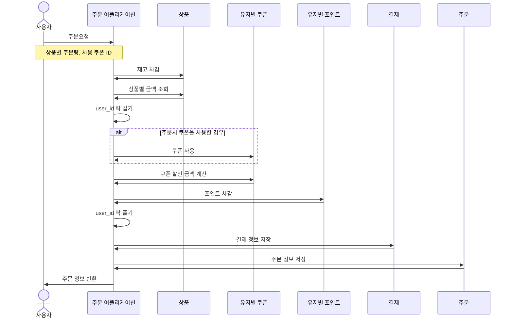

# Sequance Diagram

### 고려사항
* 기능에 초점을 맞추어 작성
* 비교적 복잡한 주문/결제에 대해서만 작성
* 어플리케이션 서비스(앱서비스)와 도메인 서비스 단위로 작성
    * 어플리케이션 서비스에만 "어플리케이션" 접미사

* 일단, 성공 Case만 작성
    * 추후 실패 케이스 작성예정

### 주문/결제 기능 (성공시)

