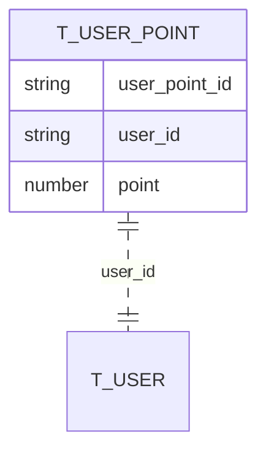
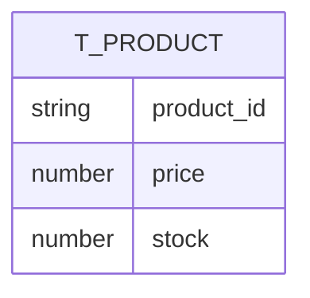
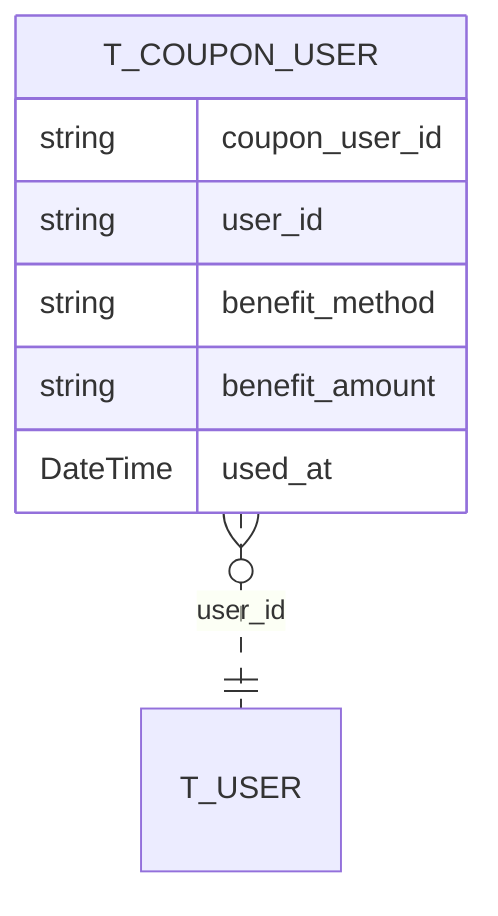
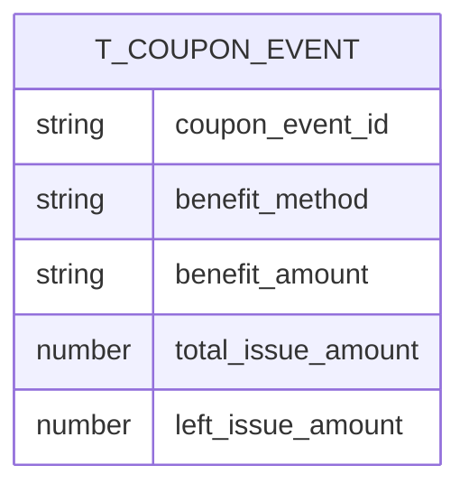
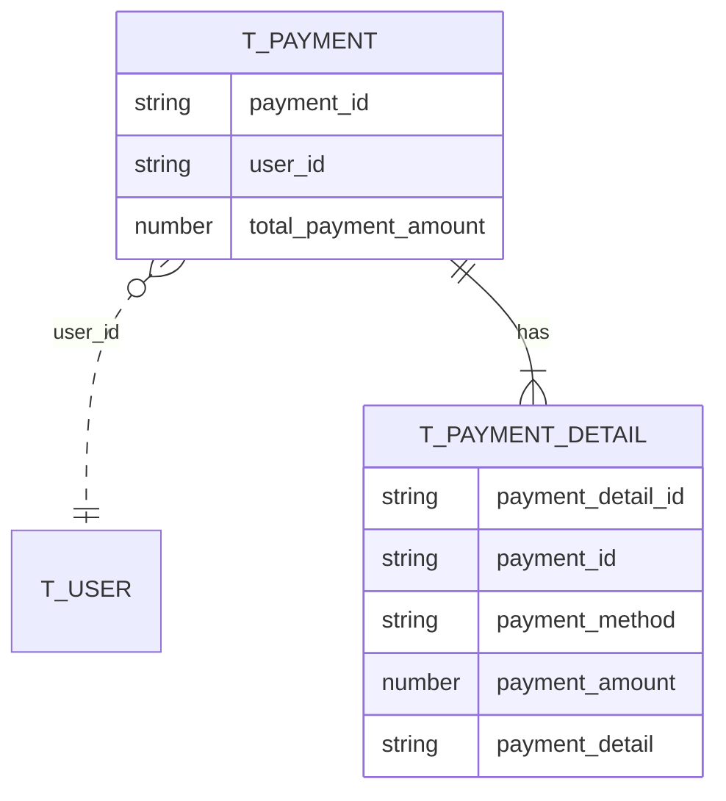
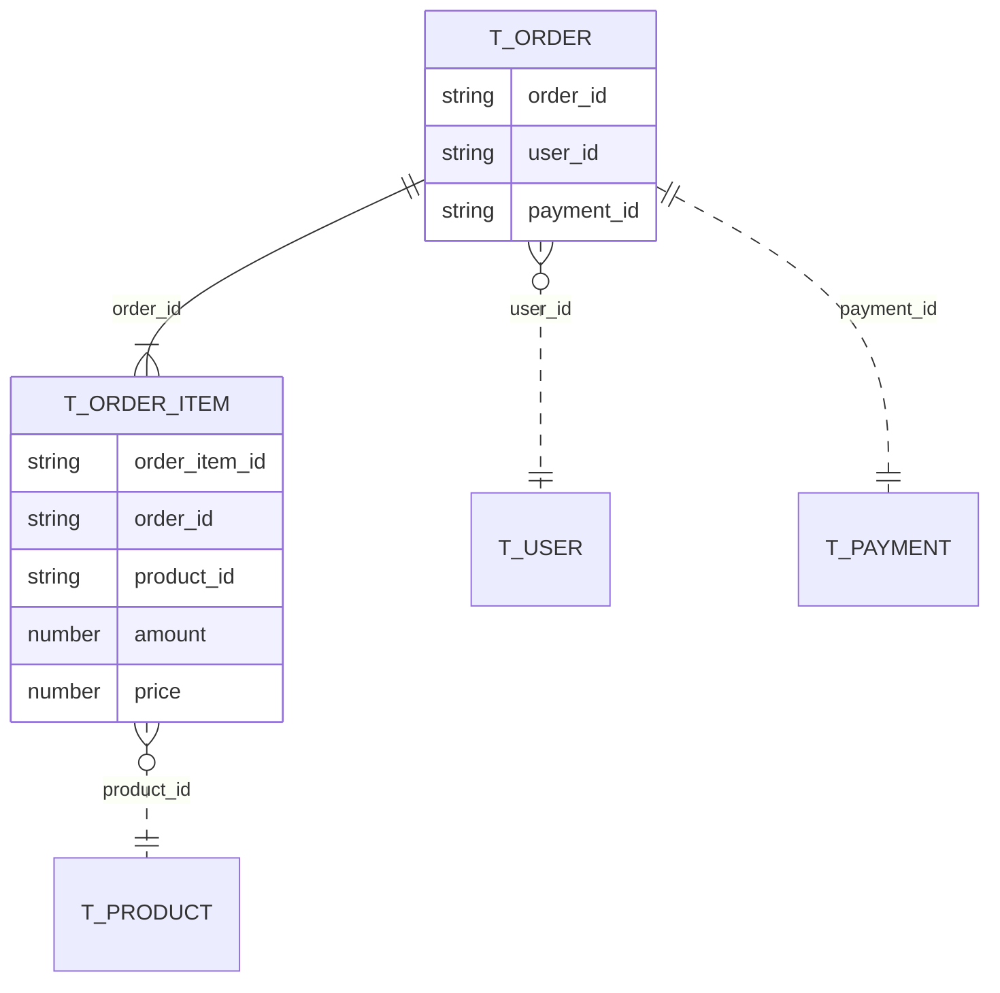

# ERD
### 고려사항
* enum들에 대해 추후 확장성(마이그레이션의 편의)을 위해 string으로 선언

### 사용자 포인트 도메인

### 상품 도메인

### 쿠폰_사용자 도메인

* benefit_method는 아래 값을만을 가짐 
    * DISCOUNT_FIXED_AMOUNT
    * DISCOUNT_PERCENTAGE
* used_at은 NULLABLE 
    * 쿠폰이 사용된 경우에만 사용 시점을 저장함 

* benefit_amount는 benefit_method에 따른 할인 양을 저장함
    * e.g.)  
    method = "DISCOUNT_FIXED_AMOUNT", amount = "100" 일 경우 
    100포인트 할인

### 쿠폰 이벤트 도메인

###  결제 도메인

* payment_detail에는 payment_method별로 상세한 정보가 들어감
    * e.g.)  
    payment_method = "COUPON"  
    payment_detail = {"couponUserId": "0000-0000-0000-000"} 
    
    * e.g.)  
    payment_method = "USER_POINT"  
    payment_detail = {"userPointId": "0000-0000-0000-000"} 

### 주문 도메인   

